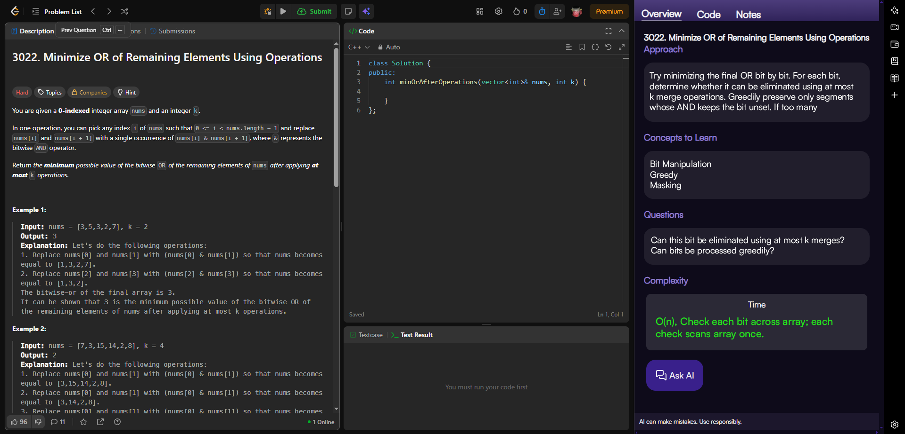

# Coworker  
### AI-powered programming mentor extension for LeetCode.

### Screenshot


Coworker helps you understand the thinking process behind DSA problems instead of showing solutions. 

It analyzes the current leetcode problem, generates a HyDE (Hypothetical Document Embeddings) query for improved semantic retrieval, retrieves related algorithmic concepts using RAG, and generates concise explanations, patterns, complexity insights, and learning guidance directly inside a sidebar.

### Architecture

```txt
LeetCode Problem
       ↓
Chrome Extension
       ↓
Backend API
       ↓
Embedding Generation
       ↓
Qdrant Vector Search
       ↓
LLM Response
       ↓
Sidebar UI
```


### RAG Pipeline

Coworker uses Retrieval-Augmented Generation to improve DSA guidance quality.

#### Pipeline
1. Extract current LeetCode problem
2. Generate HyDE query
3. Create embeddings
4. Search similar algorithmic concepts in Qdrant
5. Retrieve relevant DSA theory chunks
6. Generate explanations using LLMs
7. Render concise guidance inside sidebar


### Tech Stack
#### AI/RAG
`OpenRouter` `Qdrant` `Xenova Transformers` `BGE Embeddings`
#### Frontend Technologies
`React.js` `Chrome Extension APIs`

#### Backend Technologies
`Node.js` `Express.js` 

